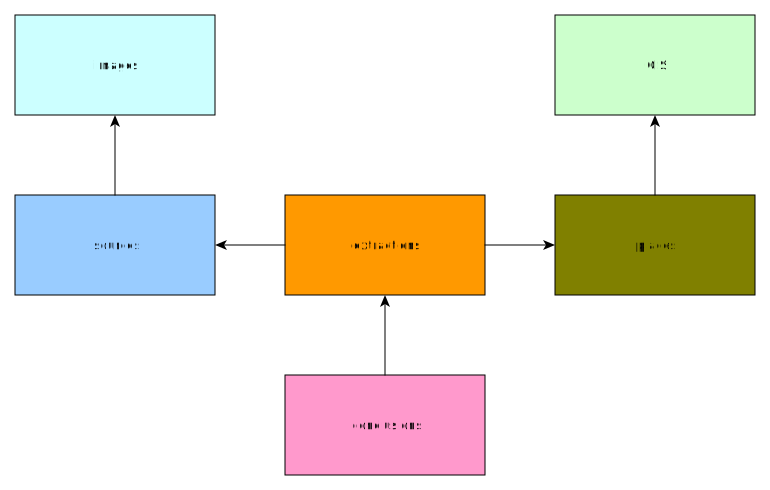

# Genealogy Research Database

Copyright © 1998–2020, by Christopher Alan Mosher, Shelton, Connecticut, USA, cmosher01@gmail.com

## Genealogical Database System

1. Images
   photographs, facsimiles
   [IIPImage](https://iipimage.sourceforge.io/)
1. Sources
   TEI format: transcripts, citations
   [Tei-Server](https://github.com/cmosher01/Tei-Server)
1. GIS database
   geographic areas (of places)
   [TerraLib](http://www.terralib.org/)
1. Genealogical data storage (graph database)
   extractions (personae, events), conclusions, historical places
   [Neo4j](https://neo4j.com/)
1. GenealDB web server
   browser-based user interface for Genealogical data storage

## GenealDB

This is designed to be a replacement for [GEDCOM](https://www.familysearch.org/wiki/en/GEDCOM).
