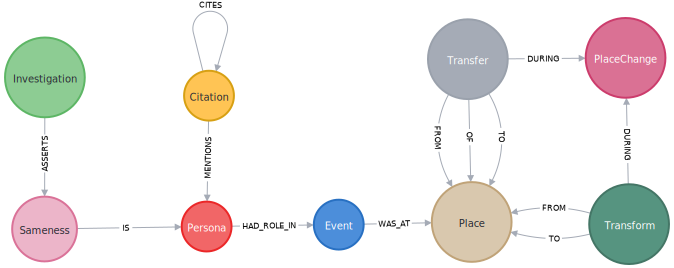

# Genealogy Research Database

Copyright © 2018–2019, by Christopher Alan Mosher, Shelton, Connecticut, USA, cmosher01@gmail.com

This is designed to be a replacement for [GEDCOM](https://www.familysearch.org/wiki/en/GEDCOM).
