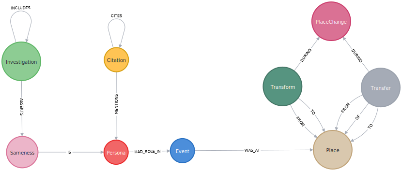

# ARCHIVED

This is based on obsolete technology (namely Neo4j-OGM), and so is being archived.
This project might have some useful source code, such as the model classes
in [model](./src/main/java/nu/mine/mosher/genealdb/model) or
[prove](./src/main/java/nu/mine/mosher/genealogy/prove), which are still in
an incomplete state.

This had morphed into a more generic, desktop application,
[digred](https://www.github.com/cmosher01/digred), wherein the models here
are given as the schema
[genopcit.digr](https://github.com/cmosher01/digred/blob/main/example/genopcit.digr).

See also [Graph-Data-Web](https://github.com/cmosher01/digred/blob/main/example/cmosher01/Graph-Data-Web),
which was another attempt at a genericized version, also now deprecated and archived.

The overall Genealogical Research Database System, presented below, is
still accurate, as of this writing.

# GenealDB

Copyright © 1998–2020, by Christopher Alan Mosher, Shelton, Connecticut, USA, cmosher01@gmail.com

## Genealogical Research Database System

1. Images \
   photographs, facsimiles \
   [IIPImage](https://iipimage.sourceforge.io/)
1. Sources \
   TEI format: transcripts, citations \
   [Tei-Server](https://github.com/cmosher01/Tei-Server)
   [Evidence Explained](http://www.worldcat.org/oclc/1054383552)
1. GIS database \
   geographic areas (of places) \
   [TerraLib](http://www.terralib.org/)
1. Genealogical data storage (graph database) \
   extractions (personae, events), conclusions, historical places \
   [Neo4j](https://neo4j.com/)
1. Universal access \
   unicode fonts and stylesheets \
   [PlainWebCss](https://github.com/cmosher01/PlainWebCss)
1. GenealDB web server \
   browser-based user interface for Genealogical data storage

## GenealDB

This is designed to be a replacement for [GEDCOM](https://www.familysearch.org/wiki/en/GEDCOM).
